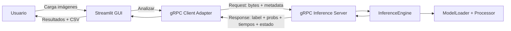

Perfecto, hagamos el ticket **B1: [Arquitectura] Diseñar arquitectura lógica del prototipo (Streamlit + gRPC + inferencia)**. Abajo te dejo el **contenido listo para pegar en `docs/arquitectura.md`** (incluye diagrama + responsabilidades + flujo end-to-end + decisiones clave).

> Nota rápida: algunos archivos que habías subido en la conversación ya **expiraron**. Si quieres que esta arquitectura quede 100% alineada con un diagrama/plantilla específica de esos archivos, vuelve a subirlos y lo ajusto sobre ese material.

---

## Arquitectura lógica del prototipo (Streamlit + gRPC + inferencia)

### Propósito

El prototipo implementa una aplicación web en **Streamlit** que permite cargar imágenes (individual o lote) y obtener una clasificación **IA vs Real** usando un modelo preentrenado. Por requerimiento del curso, la comunicación entre la interfaz y el motor de inferencia se realiza mediante **gRPC**, separando claramente los módulos de presentación (GUI) y procesamiento (servicio de inferencia). El resultado se presenta por imagen con **confianza** y **tiempos**, y se consolida en un **CSV** descargable.

---

### Componentes y responsabilidades

**1) Interfaz (Streamlit / GUI)**

* Entrada de usuario: carga de imágenes (JPG/JPEG/PNG) en lote.
* Presentación: vista previa, estado por imagen (pendiente / procesando / éxito / error).
* Orquestación de análisis: botón “Analizar” que llama al cliente gRPC.
* Salida: tabla/tarjetas con predicción, probabilidades y tiempos; descarga CSV.
* Disclaimer visible: “herramienta de apoyo, no certificación forense”.

**2) Cliente gRPC (Adapter en la GUI)**

* Empaqueta cada imagen (bytes + metadata) según el contrato `.proto`.
* Envía requests al servicio de inferencia y recibe responses.
* Maneja errores de conectividad y timeouts (server caído, timeout, respuesta inválida).
* Devuelve a la GUI una estructura uniforme (éxito/error) para consolidación y CSV.

**3) Servicio de inferencia (Servidor gRPC)**

* Expone métodos gRPC para clasificación.
* Maneja decodificación de bytes → imagen (PIL), validación y errores por imagen.
* Ejecuta preprocesamiento con `AutoImageProcessor`.
* Ejecuta inferencia con `SiglipForImageClassification` en CPU (modo `eval`).
* Calcula probabilidades (softmax), predicción, y mide tiempos.
* Responde con estructura estándar (label, probs, tiempos, estado/error).

**4) Motor de inferencia (submódulo interno del servidor)**

* `ModelLoader`: carga única del modelo y processor al iniciar el servicio.
* `InferenceEngine`: funciones `preprocess()`, `predict()`, `timing()` y manejo de excepciones.

**5) Consolidación de resultados (Data/CSV)**

* Estructura estándar (schema) para resultados por imagen.
* Construye DataFrame del lote y genera CSV descargable desde la GUI.

---

### Diagrama lógico (alto nivel)

---

### Flujo end-to-end (secuencia)

1. El usuario carga 1 o varias imágenes en Streamlit.
2. La GUI valida formatos y muestra previews/estado “Pendiente”.
3. Al presionar **Analizar**, la GUI invoca el **cliente gRPC** (por imagen o por lote).
4. El **servidor gRPC** recibe la solicitud:

   * decodifica bytes,
   * preprocesa,
   * ejecuta inferencia,
   * calcula probabilidades y tiempos,
   * retorna respuesta (éxito o error controlado).
5. La GUI recibe respuestas, actualiza estados por imagen y muestra tabla de resultados.
6. Se consolida un DataFrame y se habilita la **descarga CSV**.
7. Se mantiene visible el **disclaimer** (no forense, apoyo a verificación).

---

### Contrato de comunicación (nivel conceptual)

Para mantener el MVP simple y consistente, el contrato se define para devolver siempre una respuesta estructurada por imagen con:

* `predicted_label` (por ejemplo: `ai` / `human` o las etiquetas del modelo),
* `probabilities` (por clase),
* `preprocess_time_ms` y `inference_time_ms`,
* `status` (OK / ERROR),
* `error_message` (si aplica).

> Implementación recomendada: **RPC por imagen** (`ClassifyImage`) y la GUI itera el lote. Esto reduce complejidad inicial. Si el rendimiento lo exige, se puede añadir luego `ClassifyBatch` (nice-to-have).

---

### Manejo de errores (definición mínima)

* **Errores por imagen**: imagen corrupta, formato inválido, falla de decodificación → respuesta `status=ERROR` sin tumbar el servidor ni frenar el lote.
* **Errores de servicio**: servidor no disponible o timeout → la GUI muestra mensaje claro y evita crash.
* **Errores parciales**: el lote continúa; el CSV registra tanto éxitos como errores.

---

### Estructura del repositorio organización en módulos

* `app/`

  * `app.py` (Streamlit)
  * `grpc_client.py` (adapter)
  * `csv_export.py` (consolidación y descarga)
* `service/`

  * `server.py` (gRPC server)
  * `inference_engine.py` (preprocess + predict + timing)
  * `model_loader.py` (carga modelo/processor)
* `proto/`

  * `inference.proto`
  * `generated/` (stubs)
* `tests/`

  * pruebas smoke (1 imagen, lote, inválidas)
* `docs/`

  * `arquitectura.md` (este documento)

### Decisiones de diseño (por qué así)

* **Separación GUI vs inferencia**: mejora claridad, permite cumplir requisito gRPC y simplifica pruebas.
* **gRPC mínimo viable**: suficiente para comunicación obligatoria sin complejidad innecesaria.
* **Inferencia en CPU**: coherente con alcance acotado; medición de tiempos permite evidenciar limitaciones.
* **Respuesta estandarizada**: facilita tabla en GUI, CSV y pruebas automatizadas.